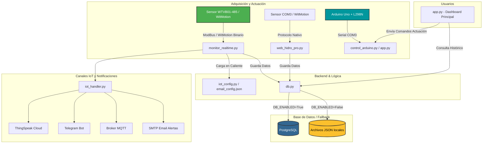

# Reporte de Ingeniería Inversa: HidroMira IoT

Este documento presenta una investigación detallada de la arquitectura, los componentes y los flujos de datos del sistema **HidroMira**, desarrollado para la Central Hidroeléctrica Mira. Este análisis sirve como punto de partida para continuar el desarrollo e implementar las mejoras pendientes para producción.

---

## 📐 Arquitectura General del Sistema

El sistema HidroMira está compuesto por:
1. **Adquisición de Datos (Sensores)**: Captura de vibraciones en 3 ejes ($V_x$, $V_y$, $V_z$) mediante sensores de vibración (ModBus RTU o protocolo nativo WitMotion).
2. **Controladores Físicos (Actuadores)**: Un Arduino Uno que controla la velocidad de giro de un motor de demostración (a través de un puente H L298N) y la posición de un servomotor (ángulo).
3. **Plataforma Web (Monitoreo e Interfaz)**: Paneles web interactivos creados con **Streamlit** y **Flask** con soporte de autenticación local.
4. **Capa de Base de Datos y Almacenamiento**: PostgreSQL como base de datos primaria con un mecanismo de **fallback transparente** a archivos JSON locales (`users.json`, `historical_data.json`, `maintenance_log.json`).
5. **Capa IoT e Integraciones**: Envío de datos a la nube con **ThingSpeak**, alertas por **Telegram**, telemetría **MQTT**, **Webhooks** HTTP y alertas por correo en formato HTML enriquecido a través de **SMTP (Gmail/Azure)**.

---

## 📁 Detalle de Componentes y Archivos

### 1. Panel de Administración y Análisis Principal (`app.py`)
- **Tecnología**: Streamlit.
- **Función**: Panel unificado para el personal de planta. Incluye seis secciones principales:
  - **⚡ Monitoreo en Tiempo Real**: Visualización de los datos leídos del sensor ModBus en $COM8$ (o simulación). Realiza publicaciones IoT a ThingSpeak/MQTT y gestiona el envío de alertas automáticas (Gmail/Azure).
  - **📊 Análisis Histórico**: Filtrado de lecturas históricas por períodos de tiempo o rangos de fechas personalizados.
  - **🏭 Datos Técnicos y Mantenimiento**: Registro de bitácoras de mantenimiento preventivo/correctivo y controles para copias de seguridad inmediatas.
  - **⚙️ Rendimiento vs Vibraciones**: Análisis de correlación entre las RPM de la turbina y la magnitud de la vibración.
  - **🔧 Control de Motor y Servo**: Interfaz para encender/detener el motor de inducción y configurar el servomotor que controla el flujo de agua virtual.
  - **🪵 Consola de Registros (Logs)**: Visualización en tiempo real de los logs del sistema (`hidromira.log`).
- **Roles Requeridos**: Requiere inicio de sesión. Acceso restringido por roles (`tecnico`, `admin`, `ingeniero_jefe`).

### 2. Panel Especializado en Tiempo Real (`monitor_realtime.py`)
- **Tecnología**: Streamlit con auto-refresco (cada 500 ms usando `streamlit-autorefresh`).
- **Función**: Diseñado como un panel exclusivo e independiente de visualización de datos en tiempo real. 
- **Flujo**: Lee el sensor ModBus (en $COM8$, dirección 80/0x50), calcula el valor RMS máximo en los 3 ejes, clasifica la vibración según la norma **ISO 20816-3 (Grupo 1)** (Zonas A, B, C, D), y publica la información a ThingSpeak, MQTT y alertas por Telegram/correo electrónico en caso de sobrepasar los umbrales de seguridad. Guarda los datos históricos cada 50 muestras.

### 3. Dashboard Web Alternativo WitMotion (`web_hidro_pro.py`)
- **Tecnología**: Streamlit con multihilo (`threading.Thread`).
- **Función**: Diseñado para el sensor de vibraciones WitMotion utilizando su **protocolo binario nativo** en lugar de ModBus RTU sobre el puerto $COM3$.
- **Detalle Técnico**: Ejecuta un lector en segundo plano (`background_reader`) que consume una cola asíncrona de datos para no bloquear la renderización de la interfaz de usuario. Decodifica los frames binarios (header `0x55 0x51`, lectura de registros de velocidad `0x3d` a `0x3f`, checksum y conversión a punto flotante).

### 4. Controlador de Actuadores (`control_arduino.py`)
- **Tecnología**: Flask (API REST) + HTML con diseño premium (Glassmorphism & CSS).
- **Función**: Actúa como un servidor web independiente (por defecto en el puerto $5000$) para gobernar el Arduino a través de comandos seriales en $COM3$.
- **API Endpoints**:
  - `GET /api/status`: Obtiene el estado actual del motor, servo, logs de comandos y puertos disponibles.
  - `POST /api/servo`: Cambia el ángulo del servomotor (`S<angulo>\n`).
  - `POST /api/motor`: Cambia la velocidad del motor (`M<velocidad>\n`, rango -255 a 255).
  - `POST /api/connect` / `POST /api/disconnect`: Controla la conexión física al puerto serial o activa el modo simulación.

### 5. Firmware del Microcontrolador (`arduino_control/arduino_control.ino`)
- **Tecnología**: C++ (Arduino).
- **Función**: Recibe comandos por puerto serial a 9600 baudios terminados en `\n` y controla físicamente el puente H L298N (pines ENA en Pin 9 PWM, IN1 en Pin 8, IN2 en Pin 7) y el servomotor (Pin 11).
- **Protocolo**:
  - `S<valor>\n` (Servo): Ajusta la posición de 10 a 100 grados.
  - `M<valor>\n` (Motor): Cambia la velocidad entre -255 y 255.
  - Retorna confirmaciones (`ACK: Servo ajustado a...` o `ACK: Motor ajustado...`) o errores (`ERR: Comando desconocido...`).

### 6. Capa de Datos (`db.py` y `schema.sql`)
- **Tecnología**: PostgreSQL (`psycopg2`) con respaldo en archivos JSON locales.
- **Función**: Ofrece funciones abstractas para guardar y leer información de usuarios, histórico de vibraciones y registros de mantenimiento.
- **Resiliencia**: Si la base de datos PostgreSQL no responde o está deshabilitada en la configuración, guarda y lee de forma transparente de los archivos `users.json`, `historical_data.json` y `maintenance_log.json`.
- **Copias de Seguridad**: Ejecuta copias de seguridad manuales o programadas (diarias en segundo plano) de todos los archivos de datos JSON y extrae volcados estructurados de PostgreSQL al directorio `./backups`.

### 7. Gestor de Notificaciones e IoT (`iot_handler.py` e `iot_config.py`)
- **Tecnología**: Integraciones REST, Paho-MQTT, SMTP.
- **Función**: Maneja el envío asíncrono de telemetría y alarmas:
  - **ThingSpeak**: Sube la telemetría cada 15 segundos (límite del plan gratuito).
  - **MQTT**: Publica datos de vibración y RPM en tiempo real al topic `hidromira/vibraciones`.
  - **Webhooks**: Hace un HTTP POST a una URL externa.
  - **Emails**: Genera correos premium en HTML, con la tabla de referencia de la norma ISO 20816-3 incrustada, detalles de los ejes y botones de acción contextuales dinámicos basados en la URL actual de ngrok (ej: botón para "Parada de Emergencia" si la vibración es Zona D, o "Programar Parada" si es Zona C).

---

## 🔄 Flujo y Tránsito de Datos

---

## 📈 Comparativa de Modos de Lectura del Sensor

El código revela que el sensor **WTVB01-485** de WitMotion puede operar en dos modos de comunicación diferentes, implementados por el equipo en archivos separados:

| Parámetro | Modo ModBus RTU (`monitor_realtime.py` / `app.py`) | Modo Binario Nativo WitMotion (`web_hidro_pro.py`) |
| :--- | :--- | :--- |
| **Puerto serial** | Configurable (por defecto `COM8`) | Fijo (`COM3`) |
| **Protocolo** | ModBus RTU estándar (vía `minimalmodbus`) | Frame binario personalizado de WitMotion |
| **Dirección** | Dirección de dispositivo: `80` (`0x50` Hex) | Dirección de dispositivo: `80` (`0x50` Hex) |
| **Registros leídos** | `58` ($V_x$), `59` ($V_y$), `60` ($V_z$) | Comando de lectura: `0x55 0x51 <addr> <reg> <checksum>` para registros `0x3d` ($V_x$), `0x3e` ($V_y$), `0x3f` ($V_z$) |
| **Escalado** | Valor leído / `100.0` | Valor firmado de 16 bits / `100.0` |
| **Manejo de Hilos** | Síncrono con bloqueos periódicos cortos | Asíncrono en segundo plano (`threading.Thread`) |

---

## 🛠️ Estado y Tareas Pendientes para Producción

El archivo `docs/PRODUCCION.md` lista varias tareas críticas que deben abordarse antes de desplegar el sistema a producción real:

### 1. 🔐 Seguridad y Gestión de Credenciales
- [ ] **Extraer Secretos a Variables de Entorno**: Migrar las claves SMTP y de base de datos desde `iot_config.py` a un archivo `.env` cargado vía `python-dotenv` y `os.environ`.
- [ ] **Configurar HTTPS**: Instalar certificados SSL/TLS para cifrar las contraseñas de inicio de sesión en Streamlit.
- [ ] **Cambio de Contraseña Obligatorio**: Forzar a los usuarios a cambiar la contraseña temporal generada al recuperar cuenta antes de permitirles el acceso completo.

### 2. 🗄️ Base de Datos y Escalabilidad (PostgreSQL)
- [ ] **Activar PostgreSQL en Producción**: Poner `DB_ENABLED = True` en la configuración y conectar a un servidor Postgres dedicado.
- [ ] **Pool de Conexiones**: Implementar un Pool de Conexiones (como `psycopg2.pool.ThreadedConnectionPool`) para evitar abrir/cerrar conexiones en cada transacción.
- [ ] **Índices**: Crear un índice en la columna `ts` de `historical_data` para acelerar las consultas históricas.

### 3. 🌐 Infraestructura y Mantenimiento de Logs
- [ ] **Rotación de Logs**: Cambiar el manejador del archivo `hidromira.log` a un `RotatingFileHandler` para evitar que crezca indefinidamente y sature el disco del servidor.
- [ ] **Servicios en Linux**: Configurar Streamlit y Flask como servicios de `systemd` en un servidor Ubuntu VPS para inicio automático y monitoreo de estado.
- [ ] **Proxy Inverso**: Configurar Nginx para direccionar el tráfico entrante de los puertos 8502, 8503 y 5000 a través de nombres de dominio dedicados.
